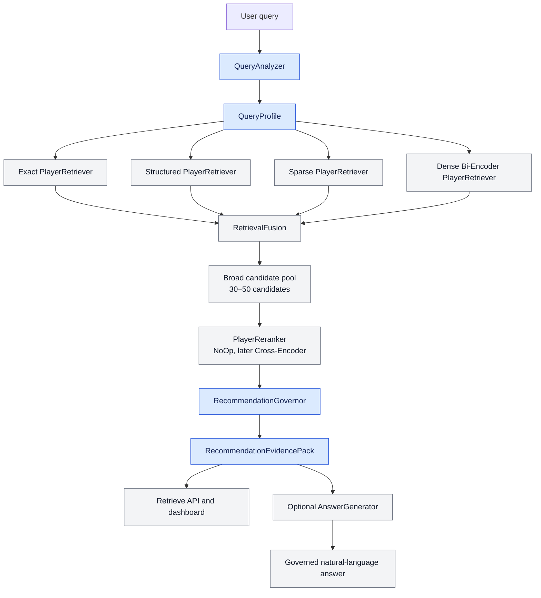

# ScoutRAG

**Evidence-based, multi-stage retrieval for football scouting.**

ScoutRAG is a portfolio project that explores how a trustworthy scouting system can combine
structured football statistics, lexical retrieval, semantic retrieval, reranking, and explicit
evidence governance. Its primary output is not free-form text: it is an auditable
`RecommendationEvidencePack` that can be inspected, evaluated, and optionally rendered by an
LLM.

> Project status: **Phase 1 — architecture foundation**. The domain contracts, component ports,
> configuration, structured logging, health endpoint, tests, and architecture documentation are
> implemented. No embedding, cross-encoder, data, or LLM model is downloaded in this phase.

## Why this is not a classic document RAG

Football evidence has a schema and a time context. ScoutRAG therefore does not concatenate
arbitrary statistics into generic text chunks. It uses typed retrieval units:

- `PlayerSeasonProfile`: one player in exactly one competition and season
- `PlayerMetricEvidence`: one sourced statistical observation and comparison group
- `MatchEvidence`: optional post-MVP match or event evidence
- `MetricDefinition`: calculation, required events, and known limitations

This prevents accidental season mixing and keeps every recommendation connected to inspectable
evidence.

## Architecture



The component boundaries are already defined; model-backed implementations arrive in later
phases. See [the detailed architecture](docs/architecture.md) for responsibilities, invariants,
and request flows.

### Separation of responsibilities

| Responsibility | Component | Output semantics |
| --- | --- | --- |
| Recall | independent `PlayerRetriever` strategies | broad candidates and provenance |
| Ranking | `RetrievalFusion`, then `PlayerReranker` | relative relevance ordering |
| Evidence governance | `RecommendationGovernor` | sufficiency verdict and quality assessment |
| Text generation | optional `AnswerGenerator` | a projection of facts already in the evidence pack |

A cosine similarity is never reused as a confidence or evidence-quality value. The
`evidence_quality_score` is a transparent, initially rule-based assessment on a `0..1` scale—not a
probability that a recommendation is correct.

## Phase 1 scope

Implemented:

- strict Pydantic domain models for queries, player evidence, retrieval, runtime data, and
  governance
- explicit `QueryIntent` and `EvidenceVerdict` enums
- abstract ports for `QueryAnalyzer`, `PlayerRetriever`, `RetrievalFusion`, `PlayerReranker`,
  `RecommendationGovernor`, and `AnswerGenerator`
- dependency-injection contract for the complete component graph
- minimal `NoOpPlayerReranker` for pre-cross-encoder integration tests
- environment-based configuration and JSON logging
- FastAPI application factory and `GET /health`
- model invariant, governance, serialization, and API tests
- Ruff, mypy, pytest, and coverage configuration

Deliberately not implemented yet:

- StatsBomb ingestion or feature engineering
- exact, structured, sparse, or dense retrieval
- embedding or cross-encoder model downloads
- rule-based governance implementation
- `/api/v1/retrieve`, `/api/v1/answer`, or `/api/v1/search`
- dashboard and LLM generation

## Domain contracts

The central API-independent result is:

```python
class RecommendationEvidencePack:
    query_profile: QueryProfile
    governance: RecommendationGovernance
    candidates: list[RankedPlayerCandidate]
    retrieval_trace: RetrievalTrace
    metric_evidence: dict[str, list[PlayerMetricEvidence]]
    limitations: list[str]
    missing_evidence: list[str]
    runtime_metrics: RuntimeMetrics
```

It can be produced, serialized, tested, and audited without an LLM. Any future answer generator
will receive this pack rather than raw database access.

## Local development

Requirements: Python 3.11 or newer.

```bash
python -m venv .venv
source .venv/bin/activate  # Windows PowerShell: .venv\Scripts\Activate.ps1
python -m pip install -e ".[dev]"
pytest
ruff check .
ruff format --check .
mypy
```

Start the API:

```bash
uvicorn scoutrag.main:app --reload
```

Then open:

- health: `http://127.0.0.1:8000/health`
- OpenAPI: `http://127.0.0.1:8000/docs`

Configuration values use the `SCOUTRAG_` prefix. Copy `.env.example` to `.env` for local
overrides.

## Repository structure

```text
src/scoutrag/
├── api/            # HTTP transport, kept separate from domain logic
├── application/    # composition contracts and temporary adapters
├── domain/         # typed, framework-independent football and evidence models
├── ports/          # interfaces for every replaceable pipeline role
├── config.py
├── logging.py
└── main.py
tests/
├── integration/
└── unit/
docs/
└── architecture.md
```

## Roadmap

1. Data pipeline and validated season-specific StatsBomb evidence
2. Per-90 features, position groups, percentiles, profile text, and metric definitions
3. Exact, structured, BM25, and multilingual bi-encoder retrieval with normalized fusion
4. Golden retrieval dataset, candidate metrics, and ablation studies
5. Cross-encoder reranking and optional ONNX inference
6. Rule-based evidence governance with false-recommendation evaluation
7. Retrieve/answer/search APIs and explainability dashboard
8. Football bi-encoder fine-tuning with hard negatives
9. Governed, grounded optional answer generation

The evaluation plan treats candidate retrieval, reranking, governance, and generation as separate
systems. In particular, **False Recommendation Rate** will measure how often ScoutRAG presents a
recommendation as well-supported when the available evidence is insufficient.

## License

MIT — see [LICENSE](LICENSE).
