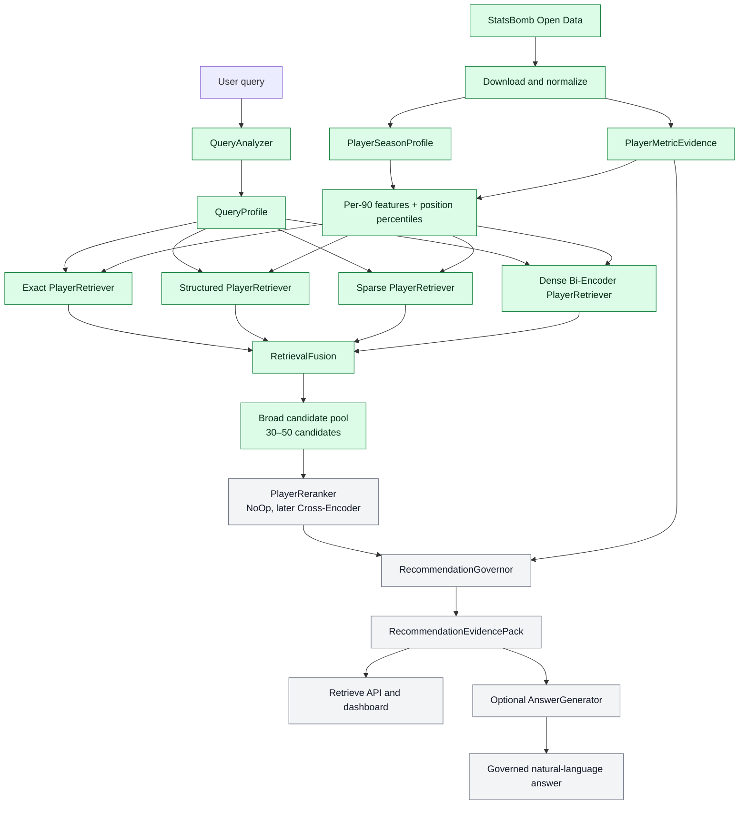
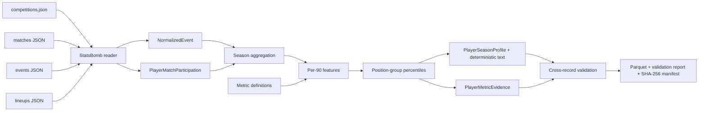

# ScoutRAG

[](https://github.com/simonmang/ScoutRAG/actions/workflows/ci.yml)

**Evidence-based, multi-stage retrieval for football scouting.**

ScoutRAG is a portfolio project that explores how a trustworthy scouting system can combine
structured football statistics, lexical retrieval, semantic retrieval, reranking, and explicit
evidence governance. Its primary output is not free-form text: it is an auditable
`RecommendationEvidencePack` that can be inspected, evaluated, and optionally rendered by an
LLM.

> Project status: **Phase 4 — hybrid retrieval MVP**. Exact, structured, BM25, and multilingual
> dense retrieval independently create a broad candidate pool. Min-max-normalized strategy scores
> are fused with configurable weights and every candidate retains its retrieval provenance.
> Cross-encoder reranking, governance implementation, and LLM generation remain separate phases.

## Why this is not a classic document RAG

Football evidence has a schema and a time context. ScoutRAG therefore does not concatenate
arbitrary statistics into generic text chunks. It uses typed retrieval units:

- `PlayerSeasonProfile`: one player in exactly one competition and season
- `PlayerMetricEvidence`: one sourced statistical observation and comparison group
- `MatchEvidence`: optional post-MVP match or event evidence
- `MetricDefinition`: calculation, required events, and known limitations

This prevents accidental season mixing and keeps every recommendation connected to inspectable
evidence.

## Architecture



The component boundaries are explicit and every recall strategy is independently testable. See
[the detailed architecture](docs/architecture.md) and
[the retrieval design](docs/retrieval.md) for responsibilities, score semantics, and request
flows.

### Separation of responsibilities

| Responsibility | Component | Output semantics |
| --- | --- | --- |
| Recall | independent `PlayerRetriever` strategies | broad candidates and provenance |
| Ranking | `RetrievalFusion`, then `PlayerReranker` | relative relevance ordering |
| Evidence governance | `RecommendationGovernor` | sufficiency verdict and quality assessment |
| Text generation | optional `AnswerGenerator` | a projection of facts already in the evidence pack |

A cosine similarity is never reused as a confidence or evidence-quality value. The
`evidence_quality_score` is a transparent, initially rule-based assessment on a `0..1` scale—not a
probability that a recommendation is correct.

## Implemented foundation

Implemented:

- strict Pydantic domain models for queries, player evidence, retrieval, runtime data, and
  governance
- explicit `QueryIntent` and `EvidenceVerdict` enums
- abstract ports for `QueryAnalyzer`, `PlayerRetriever`, `RetrievalFusion`, `PlayerReranker`,
  `RecommendationGovernor`, and `AnswerGenerator`
- dependency-injection contract for the complete component graph
- minimal `NoOpPlayerReranker` for pre-cross-encoder integration tests
- environment-based configuration and JSON logging
- FastAPI application factory and `GET /health`
- model invariant, governance, serialization, and API tests
- Ruff, mypy, pytest, and coverage configuration
- custom StatsBomb Open Data downloader and strict filesystem reader
- flat, source-linked event normalization
- player minutes calculated from explicit lineup position intervals
- raw event-count aggregation into season-specific profiles and metric evidence
- 13 documented per-90 or rate features with stable calculation contracts
- refined goalkeeper, defensive, midfield, winger, and forward comparison groups
- tie-aware position-group percentiles gated by minutes and source coverage
- a transparent Data Quality Score based on coverage, minutes, features, and comparison group
- deterministic, non-generative player profile text
- explicit multi-team transfer provenance with a minutes-based primary team
- cross-record validation for coverage, duplicates, season integrity, and minutes
- Zstandard-compressed Parquet artifacts and a SHA-256 reproducibility manifest
- `scoutrag-data` command-line interface
- German/English rule-based query analysis with intent, team, position, metric, season, and
  minimum-minute filters
- independent exact, structured-feature, dependency-free BM25, and dense bi-encoder retrievers
- multilingual `paraphrase-multilingual-MiniLM-L12-v2` baseline with a persisted local index
- min-max score normalization and configurable weighted retrieval fusion
- broad candidate-pool orchestration, per-strategy provenance, hard filters, and stage timings
- `scoutrag-retrieve` command-line interface

Deliberately not implemented yet:

- football-specific bi-encoder fine-tuning
- cross-encoder reranking
- rule-based governance implementation
- `/api/v1/retrieve`, `/api/v1/answer`, or `/api/v1/search`
- dashboard and LLM generation

## Phase 4 hybrid retrieval

Install the optional model stack and run a search:

```powershell
python -m pip install -e ".[dev,retrieval]"
scoutrag-retrieve "pressingstarker Sechser von Bayern München mit mindestens 100 Minuten"
```

The first dense run downloads the configured model and creates
`data/processed/bundesliga-2023-2024/dense_index.json`. Generated embeddings remain ignored by
Git. Later process starts reuse this profile index; `--rebuild-dense-index` explicitly refreshes
it. A model-free baseline remains available:

```powershell
scoutrag-retrieve "Zeige das Profil von Joshua Kimmich" --disable-dense
```

Default fusion:

```text
fused_score =
0.30 × normalized_dense
+ 0.25 × normalized_BM25
+ 0.30 × normalized_structured
+ 0.15 × normalized_exact
```

Missing strategy signals contribute zero, so agreement across independent strategies is rewarded.
The fused score is a relevance signal—not confidence, evidence quality, or a probability.

Local real-data smoke test:

| Measure | Result |
| --- | ---: |
| Indexed profiles | 373 |
| Embedding dimensions | 384 |
| Bayern-filtered test result | Leon Goretzka |
| Strategies agreeing on result | exact, structured, BM25, dense |
| Warm dense query stage | about 69 ms |
| Cold model load + dense query | about 108 s on local CPU |

The cold-start measurement includes loading the roughly 480 MB model. It is intentionally kept
separate from warm request latency.

## Phase 3 data pipeline

The default reference source is StatsBomb Open Data for **1. Bundesliga 2023/2024**
(`competition_id=9`, `season_id=281`). ScoutRAG downloads only the selected season rather than
cloning the complete upstream repository.

> Coverage limitation: this open-data competition entry contains Bayer Leverkusen's 34 league
> matches, not all 306 Bundesliga fixtures. ScoutRAG itself is team-neutral and uses Bayern Munich
> in examples where the source permits it. Bayern appears in only two observed matches, so its
> profiles are correctly marked as partial and receive no position percentile. Leverkusen is used
> here only because the upstream test partition provides its full season.



Download and build the reference dataset:

```powershell
scoutrag-data download --competition-id 9 --season-id 281
scoutrag-data build --competition-id 9 --season-id 281
```

For a fast smoke test:

```powershell
scoutrag-data download --competition-id 9 --season-id 281 --match-limit 2
scoutrag-data build --competition-id 9 --season-id 281
```

Generated artifacts under `data/processed/bundesliga-2023-2024/`:

| Artifact | Purpose |
| --- | --- |
| `matches.parquet` | competition-safe match metadata |
| `events.parquet` | normalized, source-linked event records |
| `player_match_minutes.parquet` | minutes, starts, teams, and dominant positions |
| `player_season_profiles.parquet` | raw and normalized features, percentiles, quality, profile text |
| `player_metric_evidence.parquet` | raw and normalized audit-ready observations |
| `metric_definitions.json` | calculation, required event types, and limitations for 13 metrics |
| `validation_report.json` | errors, limitations, and coverage counts |
| `manifest.json` | source metadata, schema version, byte sizes, and SHA-256 hashes |

Validated local reference build:

| Measure | Result |
| --- | ---: |
| Matches | 34 |
| Normalized events | 137,765 |
| Player-match participation records | 1,049 |
| Unique player-season profiles | 373 |
| Metric evidence records | 11,563 |
| Documented feature metrics | 13 |
| Profiles with source-comparable position percentiles | 15 |
| Bayern Munich profiles | 21, all transparently partial |
| Explicit multi-team profiles | 4 |
| Validation errors | 0 |

Raw and generated data are excluded from Git. Small representative fixtures remain in the test
suite, so CI is deterministic and does not depend on the network.

## Domain contracts

The central API-independent result is:

```python
class RecommendationEvidencePack:
    query_profile: QueryProfile
    governance: RecommendationGovernance
    candidates: list[RankedPlayerCandidate]
    retrieval_trace: RetrievalTrace
    metric_evidence: dict[str, list[PlayerMetricEvidence]]
    limitations: list[str]
    missing_evidence: list[str]
    runtime_metrics: RuntimeMetrics
```

It can be produced, serialized, tested, and audited without an LLM. Any future answer generator
will receive this pack rather than raw database access.

## Local development

Requirements: Python 3.11 or newer.

```bash
python -m venv .venv
source .venv/bin/activate  # Windows PowerShell: .venv\Scripts\Activate.ps1
python -m pip install -e ".[dev,retrieval]"
pytest
ruff check .
ruff format --check .
mypy
```

Start the API:

```bash
uvicorn scoutrag.main:app --reload
```

Then open:

- health: `http://127.0.0.1:8000/health`
- OpenAPI: `http://127.0.0.1:8000/docs`

Configuration values use the `SCOUTRAG_` prefix. Copy `.env.example` to `.env` for local
overrides.

## Repository structure

```text
src/scoutrag/
├── api/            # HTTP transport, kept separate from domain logic
├── application/    # composition contracts and temporary adapters
├── data/           # download, normalization, minutes, validation, and Parquet
├── domain/         # typed, framework-independent football and evidence models
├── ports/          # interfaces for every replaceable pipeline role
├── retrieval/      # query analysis, four retrievers, fusion, trace, and CLI
├── config.py
├── logging.py
└── main.py
tests/
├── integration/
├── fixtures/
└── unit/
data/
├── raw/            # ignored downloaded JSON
└── processed/      # ignored generated artifacts
docs/
└── architecture.md
```

## Roadmap

1. ✅ Architecture foundation and typed evidence contracts
2. ✅ Data pipeline and validated season-specific StatsBomb evidence
3. ✅ Per-90 features, refined position groups, percentiles, profile text, and metric definitions
4. ✅ Exact, structured, BM25, and multilingual bi-encoder retrieval with normalized fusion
5. Golden retrieval dataset, candidate metrics, and ablation studies
6. Cross-encoder reranking and optional ONNX inference
7. Rule-based evidence governance with false-recommendation evaluation
8. Retrieve/answer/search APIs and explainability dashboard
9. Football bi-encoder fine-tuning with hard negatives
10. Governed, grounded optional answer generation

The evaluation plan treats candidate retrieval, reranking, governance, and generation as separate
systems. In particular, **False Recommendation Rate** will measure how often ScoutRAG presents a
recommendation as well-supported when the available evidence is insufficient.

## License

MIT — see [LICENSE](LICENSE).
