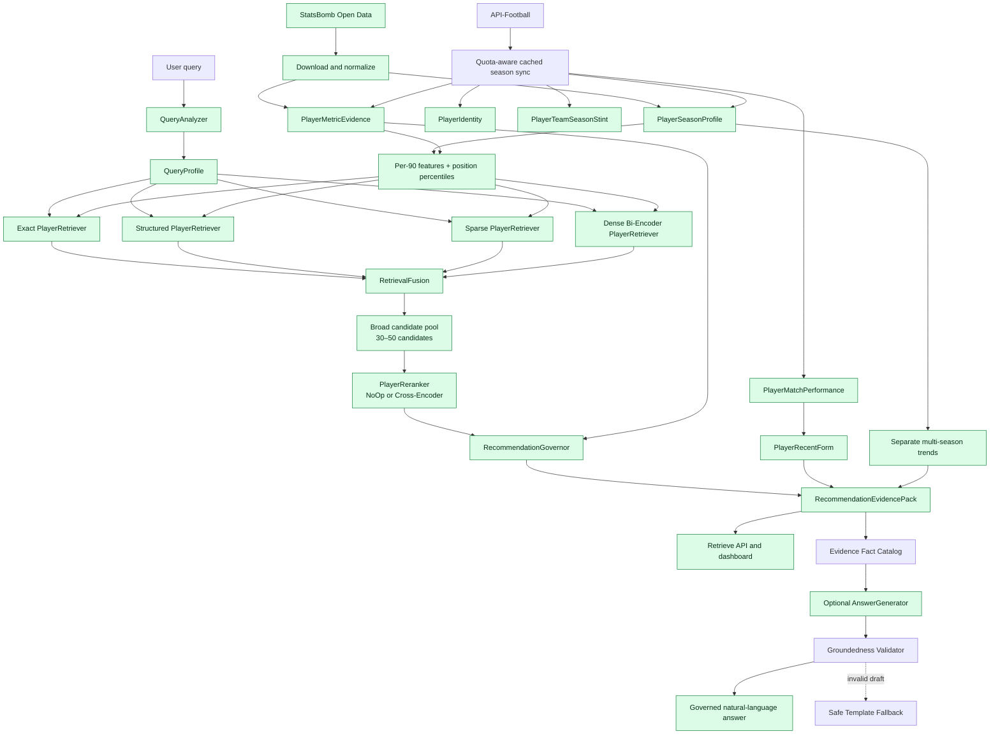
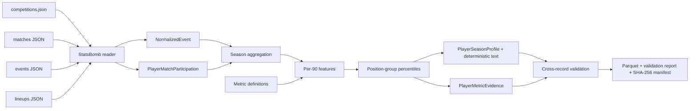

# ScoutRAG

[](https://github.com/simonmang/ScoutRAG/actions/workflows/ci.yml)
[](https://github.com/simonmang/ScoutRAG/releases)

**Evidence-based, multi-stage retrieval for football scouting.**

ScoutRAG is a portfolio project that explores how a trustworthy scouting system can combine
structured football statistics, lexical retrieval, semantic retrieval, reranking, and explicit
evidence governance. Its primary output is not free-form text: it is an auditable
`RecommendationEvidencePack` that can be inspected, evaluated, and optionally rendered by an
LLM.

> Project status: **1.0 — portfolio-ready**. All ten planned architecture phases are implemented.
> A one-click local dashboard, Docker image, and container smoke test make the complete API
> independently demonstrable once you have generated your own dataset.

## Try the portfolio demo

ScoutRAG works on real, current football statistics from
[API-Football](https://www.api-football.com/), which requires your own free or paid API key — the
free plan already covers a single league/season for a first look; the multi-league dataset used
in development needs a paid plan. ScoutRAG never ships or redistributes API-Football data itself
(their terms prohibit republishing it to third parties), so generating your own dataset is the
first step, not an optional extra:

```powershell
# 1. Put your key in the ignored local .env file (copy from .env.example):
#    API_FOOTBALL_KEY=...
# 2. Generate a dataset (see "Optional API-Football data sync" below for the full workflow):
.\sync_scouting_universe.ps1 -Groups top5 -SeasonStartYear 2025
.\sync_scouting_universe.ps1 -Build -Groups top5 -SeasonStartYear 2025
```

Then, on Windows, double-click `start_dashboard.cmd`, or run the PowerShell launcher directly:

```powershell
.\start_dashboard.ps1
```

The launcher opens `http://127.0.0.1:8000` and keeps all traffic on the local machine. Exact,
structured, and BM25 retrieval, fusion, governance, traces, safe answers, and the dashboard are
active by default; dense retrieval and model-backed generation remain opt-in.

Docker and CI use a separate, entirely invented three-player fixture
(`scripts/build_synthetic_ci_fixture.py`) baked into the image only to prove the packaged
application starts and serves a governed result — it is never presented as real football data:

```powershell
docker build --tag scoutrag:1.0.1 .
docker run --rm --publish 8000:8000 scoutrag:1.0.1
```

For an illustration of the data shape without generating anything, see the
[synthetic example below](#what-the-generated-data-looks-like) and the
[local demo guide](docs/local-demo.md) and [data notes](data/README.md).

### What the generated data looks like

This is invented, not real output, purely to show the schema shape:

```json
{
  "player_id": "api-football:502",
  "profile_id": "api-football:78:2025:502",
  "player_name": "Sample Player",
  "team_name": "Sample FC",
  "competition_name": "Sample League",
  "season_name": "2025/2026",
  "position_group": "defensive_midfield",
  "minutes_played": 2280.0,
  "structured_features": { "pressures_per_90": 18.4, "duel_win_rate": 61.2 },
  "percentiles": { "pressures_per_90": 88.0, "duel_win_rate": 74.8 },
  "data_quality": 0.987
}
```

`position_group` values like `defensive_midfield` or `center_back` come from the
[refined tactical position](#refined-tactical-positions-from-lineup-formations) step described
below, derived from real generated data — not invented for this example.

## Why this is not a classic document RAG

Football evidence has a schema and a time context. ScoutRAG therefore does not concatenate
arbitrary statistics into generic text chunks. It uses typed retrieval units:

- `PlayerSeasonProfile`: one player in exactly one competition and season
- `PlayerMetricEvidence`: one sourced statistical observation and comparison group
- `MatchEvidence`: optional post-MVP match or event evidence
- `MetricDefinition`: calculation, required events, and known limitations

This prevents accidental season mixing and keeps every recommendation connected to inspectable
evidence.

## Architecture



The component boundaries are explicit and every recall strategy is independently testable. See
[the detailed architecture](docs/architecture.md) and
[the retrieval design](docs/retrieval.md) for responsibilities, score semantics, and request
flows. Governance factors and verdict precedence are documented in
[the Phase 7 governance guide](docs/governance.md).

### Separation of responsibilities

| Responsibility | Component | Output semantics |
| --- | --- | --- |
| Recall | independent `PlayerRetriever` strategies | broad candidates and provenance |
| Ranking | `RetrievalFusion`, then `PlayerReranker` | relative relevance ordering |
| Evidence governance | `RecommendationGovernor` | sufficiency verdict and quality assessment |
| Text generation | optional `AnswerGenerator` | a projection of facts already in the evidence pack |

A cosine similarity is never reused as a confidence or evidence-quality value. The
`evidence_quality_score` is a transparent, initially rule-based assessment on a `0..1` scale—not a
probability that a recommendation is correct.

## Implemented foundation

Implemented:

- strict Pydantic domain models for queries, player evidence, retrieval, runtime data, and
  governance
- explicit `QueryIntent` and `EvidenceVerdict` enums
- abstract ports for `QueryAnalyzer`, `PlayerRetriever`, `RetrievalFusion`, `PlayerReranker`,
  `RecommendationGovernor`, and `AnswerGenerator`
- dependency-injection contract for the complete component graph
- minimal `NoOpPlayerReranker` for pre-cross-encoder integration tests
- environment-based configuration and JSON logging
- FastAPI application factory and `GET /health`
- model invariant, governance, serialization, and API tests
- Ruff, mypy, pytest, and coverage configuration
- custom StatsBomb Open Data downloader and strict filesystem reader
- flat, source-linked event normalization
- player minutes calculated from explicit lineup position intervals
- raw event-count aggregation into season-specific profiles and metric evidence
- 13 documented per-90 or rate features with stable calculation contracts
- refined goalkeeper, defensive, midfield, winger, and forward comparison groups
- tie-aware position-group percentiles gated by minutes and source coverage
- a transparent Data Quality Score based on coverage, minutes, features, and comparison group
- deterministic, non-generative player profile text
- explicit multi-team transfer provenance with a minutes-based primary team
- stable API-Football player identities shared across clubs, competitions, and seasons
- separate club-season stints and typed per-fixture player performances
- deterministic last-five-match form windows against the prior same-season baseline
- current-first multi-season trends that preserve every season value instead of averaging them
- cross-record validation for coverage, duplicates, season integrity, and minutes
- Zstandard-compressed Parquet artifacts and a SHA-256 reproducibility manifest
- `scoutrag-data` command-line interface
- German/English rule-based query analysis with intent, team, position, metric, season, and
  minimum-minute filters
- independent exact, structured-feature, dependency-free BM25, and dense bi-encoder retrievers
- multilingual `paraphrase-multilingual-MiniLM-L12-v2` baseline with a persisted local index
- min-max score normalization and configurable weighted retrieval fusion
- broad candidate-pool orchestration, per-strategy provenance, hard filters, and stage timings
- `scoutrag-retrieve` command-line interface
- versioned German/English Golden Dataset with graded relevance judgments and explicit limitations
- dependency-free Candidate Recall, Precision@K, Recall@K, MRR, and graded nDCG@K
- reproducible A-D retrieval ablations plus the complete Phase 4 hybrid
- auditable per-query results, macro averages, and `scoutrag-evaluate` CLI
- injectable pair-scoring boundary and multilingual `CrossEncoderPlayerReranker`
- isolated fused-order versus reranked-order evaluation over identical broad candidate pools
- Hit Rate@K, MRR/nDCG deltas, and per-query warm reranking latency
- tested Torch and explicit ONNX CPU inference with `scoutrag-rerank-evaluate`
- intent-aware `RuleBasedRecommendationGovernor` with configurable safety thresholds
- ten separately reported evidence factors and non-probabilistic Evidence Quality Score
- explicit sufficient, limited, insufficient, conflicting, and out-of-scope decisions
- candidate-safe evidence indexing and complete LLM-free `RecommendationEvidencePack` assembly
- versioned abstention cases and False Recommendation Rate evaluation
- offline-safe dense model loading through a resolved local model snapshot
- `scoutrag-govern` and `scoutrag-govern-evaluate` command-line interfaces
- lazy, thread-safe API composition over the same governed retrieval pipeline
- separate `POST /api/v1/retrieve`, `/api/v1/search`, and `/api/v1/answer` contracts
- `GET /api/v1/players/{player_id}/history` for bounded match, form, stint, and trend evidence
- a deterministic verdict-aware `TemplateAnswerGenerator` with safe abstention
- responsive explainability dashboard with candidate details and retrieval trace
- HTTP integration tests using the real model-free pipeline boundary
- versioned German/English football retrieval training and validation queries
- domain-constrained Hard-Negative mining with explicit positive and easy-negative profiles
- reproducible `MultipleNegativesRankingLoss` fine-tuning and checkpoint metadata
- baseline-vs.-fine-tuned evaluation for Golden retrieval, difficult negatives, and language
  variants
- a documented opt-in activation policy and complete football bi-encoder Model Card
- source-linked `AllowedFact` catalogs derived only from the immutable Evidence Pack
- schema-constrained `GroundedAnswerDraft` claims with explicit player and fact IDs
- governance-gated model calls and deterministic abstention for unsafe verdicts
- numeric, player, citation, and lexical groundedness validation before response delivery
- safe template fallback with visible validation violations and generation mode
- optional OpenAI Responses API adapter behind a vendor-neutral backend port
- versioned hallucination cases, Groundedness metrics, and `scoutrag-answer-evaluate` CLI
- compact validated demo artifacts with source manifest and coverage report
- Windows one-click launcher and non-root reproducible Docker image
- container smoke test covering health, dashboard, and real Kimmich retrieval

Deliberately not implemented yet:

- football-specific cross-encoder fine-tuning
- calibration against a larger, independently annotated answer-safety dataset

## Phase 10 grounded answer generation

Retrieval remains fully usable without an LLM. `SCOUTRAG_ANSWER_MODE=template` is the default.
The optional model adapter can be enabled independently:

For the easiest local Windows setup, place the key in the ignored local `.env` file as
`OPENAI_API_KEY=...`, then double-click `start_dashboard_ai.cmd`. The launcher reads the key only
into the running process and starts with `gpt-5.6-luna`. The regular `start_dashboard.cmd`
continues to use the free deterministic template mode.

```powershell
python -m pip install -e ".[llm]"
$env:OPENAI_API_KEY = "..."
$env:SCOUTRAG_ANSWER_MODE = "openai"
$env:SCOUTRAG_OPENAI_MODEL = "gpt-5.6-luna"
uvicorn scoutrag.main:app --reload
```

The adapter requests structured claims, not an unrestricted final answer. ScoutRAG then verifies
candidate IDs, fact ownership, citations, every numeric literal, and supported wording locally.
`INSUFFICIENT`, `CONFLICTING`, and `OUT_OF_SCOPE` verdicts bypass the model entirely. A backend
error or invalid claim produces `generation_mode=safe_fallback` and exposes the rejected reasons
in `grounding.violations`.

Run the committed ten-case safety benchmark without an API key or model download:

```powershell
scoutrag-answer-evaluate
```

| Answer safety metric | Result |
| --- | ---: |
| Groundedness Pass Rate | 1.000000 |
| Hallucination Block Rate | 1.000000 |
| False Grounded Rate | **0.000000** |
| Fallback Precision / Recall | 1.000000 / 1.000000 |
| Abstention Compliance | 1.000000 |
| Case Accuracy | 1.000000 |

This small rule-authored regression seed tests fabricated numbers, added players, invented Fact
IDs, model-side calculation, unsupported tactical inference, and governance abstention. It is a
repeatable safety check—not evidence of calibrated production reliability. See
[the answer-safety design](docs/answer-generation.md) and the
[machine-readable summary](evaluation/answer_grounding_summary.json).

## Phase 9 football bi-encoder fine-tuning

Run the reproducible workflow after building the Phase 3 profiles:

```powershell
python -m pip install -e ".[training]"
scoutrag-bi-encoder mine --local-files-only
scoutrag-bi-encoder train --local-files-only
scoutrag-bi-encoder evaluate --local-files-only
```

The committed seed contains 20 training and 12 held-out German/English query variants. Every
example resolves to a positive profile, an embedding-similar same-position Hard Negative that
fails one central condition, and a different-position Easy Negative.

Validated local CPU result:

| Model | Candidate Recall | MRR | nDCG@5 | Hard-negative accuracy | Bilingual stability |
| --- | ---: | ---: | ---: | ---: | ---: |
| Pretrained baseline | 1.000 | **1.000** | **0.877445** | 0.250000 | 0.166667 |
| Football fine-tuned | 1.000 | 0.950 | 0.859452 | **0.416667** | **0.333333** |

The fine-tuned model improves the task it was trained for, including both German and English, but
does not yet improve the full Golden ranking. It therefore remains opt-in and the pretrained
encoder stays the default. This activation rule prevents a targeted training win from hiding
regressions elsewhere.

See the [Model Card](docs/model-card.md), the
[machine-readable comparison](evaluation/bi_encoder_summary.json), and the
[versioned query specifications](evaluation/bi_encoder_training_queries.json).

## Phase 8 governed API and dashboard

Start the application after building the local data artifacts:

```powershell
uvicorn scoutrag.main:app --reload
```

Open `http://127.0.0.1:8000/` for the evidence console. It visualizes the verdict and
non-probabilistic Evidence Quality Score before any answer is requested.

| Endpoint | Responsibility |
| --- | --- |
| `POST /api/v1/retrieve` | returns the complete `RecommendationEvidencePack` |
| `POST /api/v1/search` | returns a compact projection from that same pipeline |
| `POST /api/v1/answer` | renders only a supplied, already governed Evidence Pack |

The default answer adapter remains deterministic and LLM-free. It can explain
`SUFFICIENT` and `LIMITED` results, but abstains for `INSUFFICIENT`, `CONFLICTING`, and
`OUT_OF_SCOPE` packs. It never performs retrieval implicitly, calculates new statistics, or adds
players. Phase 10 adds an optional grounded model adapter through the existing `AnswerGenerator`
port without changing the retrieval API.

See the [API and dashboard guide](docs/api.md) for request examples and local configuration.

## Phase 7 evidence governance

Produce a governed Evidence Pack without an LLM:

```powershell
scoutrag-govern "Zeige das Profil von Aleksandar Pavlović" --local-files-only
```

Run the seven committed safety cases:

```powershell
scoutrag-govern-evaluate --local-files-only
```

Validated local result over 373 profiles and 11,563 metric-evidence records:

| Safety metric | Result |
| --- | ---: |
| False Recommendation Rate | **0.000000** |
| Abstention Recall | 1.000000 |
| Abstention Precision | 1.000000 |
| Limited-case Recall | 1.000000 |
| Selective Accuracy | 1.000000 |
| Verdict Accuracy | 1.000000 |
| Coverage | 0.285714 |

Coverage is intentionally low because five of seven cases are designed to require abstention.
The cases include a missing requested metric, no matching player, unknown competition,
unsupported prediction, conflicting seasons, a source-covered ranking, and a partial Bayern
profile.

For Aleksandar Pavlović, exact identity retrieval is supported but the verdict is `LIMITED`
because the open-data Bayern sample has low source coverage and limited observed minutes.
The score is reported as `Evidence Quality Score: 0.812`, never as an 81.2% correctness
probability.

See the [machine-readable Phase 7 summary](evaluation/governance_summary.json), the
[versioned cases](evaluation/governance_cases.json), and the
[governance design](docs/governance.md).

## Phase 6 cross-encoder reranking

The default reranker model is
[`cross-encoder/mmarco-mMiniLMv2-L12-H384-v1`](https://huggingface.co/cross-encoder/mmarco-mMiniLMv2-L12-H384-v1).
It jointly scores each German/English query and deterministic player profile. Its raw score is
used only for relative ordering; it is not confidence, evidence quality, or a calibrated
probability.

Reproduce the Torch comparison:

```powershell
scoutrag-rerank-evaluate
```

Test the explicit ONNX artifact:

```powershell
python -m pip install -e ".[onnx]"
scoutrag-rerank-evaluate --backend onnx --onnx-file-name onnx/model.onnx
```

Validated local result over the same 10 queries, 21 judgments, and broad pools:

| Ranking | Candidate Recall | MRR | Hit Rate@1 | Hit Rate@5 | nDCG@5 |
| --- | ---: | ---: | ---: | ---: | ---: |
| Hybrid fused order | 1.000 | 1.000 | 1.000 | 1.000 | **0.900637** |
| + pretrained cross-encoder | 1.000 | 0.900 | 0.800 | 1.000 | 0.846097 |
| Delta | 0.000 | -0.100 | -0.200 | 0.000 | -0.054540 |

This negative result is retained deliberately: an off-the-shelf web-search reranker does not
automatically transfer to football scouting. It stays opt-in through `scoutrag-retrieve --rerank`
until domain-specific training or a stronger independently labeled evaluation demonstrates an
improvement. Exact lookup, Bayern team filtering, and broad recall are unaffected.

Warm local CPU timing:

| Backend | Mean | p50 | p95 |
| --- | ---: | ---: | ---: |
| Torch | 824.084 ms | 459.121 ms | 2623.870 ms |
| ONNX FP32 | 310.008 ms | 300.721 ms | 563.911 ms |

ONNX reduced mean reranking time by 62.4% in this single-machine run while producing the same
ranking metrics. Model download, loading, export, and one-pair warm-up are excluded. See the
[machine-readable Phase 6 summary](evaluation/reranking_summary.json) and
[evaluation methodology](evaluation/README.md).

## Phase 5 retrieval evaluation

Run the committed Golden Dataset against every baseline:

```powershell
scoutrag-evaluate --local-files-only --summary-only
```

Validated local result on 10 queries and 21 positive graded judgments:

| Variant | Candidate Recall | MRR | Precision@1 | Recall@5 | nDCG@5 |
| --- | ---: | ---: | ---: | ---: | ---: |
| A: BM25 | 1.000 | 0.950 | 0.900 | 1.000 | 0.847916 |
| B: pretrained bi-encoder | 1.000 | 1.000 | 1.000 | 1.000 | 0.877445 |
| C: BM25 + bi-encoder | 1.000 | 1.000 | 1.000 | 1.000 | 0.876800 |
| D: C + structured features | 1.000 | 1.000 | 1.000 | 1.000 | 0.892273 |
| H: complete Phase 4 hybrid | 1.000 | 1.000 | 1.000 | 1.000 | **0.900637** |

The Golden Dataset deliberately uses Bayern for exact, team, and position queries. Trait
judgments use only source-covered comparison groups. Candidate Recall is saturated on this small
seed because hard filters and a pool of 40 make recall comparatively easy; it is not evidence of
generalized production accuracy. See [evaluation methodology](evaluation/README.md).

## Phase 4 hybrid retrieval

Install the optional model stack and run a search:

```powershell
python -m pip install -e ".[dev,retrieval]"
scoutrag-retrieve "pressingstarker Sechser von Bayern München mit mindestens 100 Minuten"
```

The first dense run downloads the configured model and creates a `dense_index.json` next to the
configured profile path. Generated embeddings remain ignored by Git. Later process starts reuse
this profile index; `--rebuild-dense-index` explicitly refreshes it. A model-free baseline remains
available:

```powershell
scoutrag-retrieve "Show the profile of Joshua Kimmich" --disable-dense
```

Default fusion:

```text
fused_score =
0.30 × normalized_dense
+ 0.25 × normalized_BM25
+ 0.30 × normalized_structured
+ 0.15 × normalized_exact
```

Missing strategy signals contribute zero, so agreement across independent strategies is rewarded.
The fused score is a relevance signal—not confidence, evidence quality, or a probability.

Local real-data smoke test against the 12,713-profile combined dataset:

| Measure | Result |
| --- | ---: |
| Indexed profiles | 12,713 |
| Embedding dimensions | 384 |
| Bayern defensive-midfield search | Kimmich, Goretzka, Pavlović (correct trio) |
| Strategies agreeing on exact lookup | exact, sparse, dense |
| Warm dense query stage | about 66 ms |

Cold model load time was not re-measured for this dataset size; only the model itself (~480 MB)
needs loading once per process, independent of profile count.

## Optional StatsBomb data pipeline

API-Football is the active data source (see below); this StatsBomb Open Data pipeline is kept as
an alternative, independently working ingestion path into the same typed schema, demonstrating
that ScoutRAG is not tied to one provider. It is not part of the demo or the default configuration.
The reference source is **1. Bundesliga 2023/2024** (`competition_id=9`, `season_id=281`).
ScoutRAG downloads only the selected season rather than cloning the complete upstream repository.

> Coverage limitation: this open-data competition entry contains Bayer Leverkusen's 34 league
> matches, not all 306 Bundesliga fixtures. ScoutRAG itself is team-neutral and uses Bayern Munich
> in examples where the source permits it. Bayern appears in only two observed matches, so its
> profiles are correctly marked as partial and receive no position percentile. Leverkusen is used
> here only because the upstream test partition provides its full season.



Download and build the reference dataset:

```powershell
scoutrag-data download --competition-id 9 --season-id 281
scoutrag-data build --competition-id 9 --season-id 281
```

For a fast smoke test:

```powershell
scoutrag-data download --competition-id 9 --season-id 281 --match-limit 2
scoutrag-data build --competition-id 9 --season-id 281
```

Generated artifacts under `data/processed/bundesliga-2023-2024/`:

| Artifact | Purpose |
| --- | --- |
| `matches.parquet` | competition-safe match metadata |
| `events.parquet` | normalized, source-linked event records |
| `player_match_minutes.parquet` | minutes, starts, teams, and dominant positions |
| `player_season_profiles.parquet` | raw and normalized features, percentiles, quality, profile text |
| `player_metric_evidence.parquet` | raw and normalized audit-ready observations |
| `metric_definitions.json` | calculation, required event types, and limitations for 13 metrics |
| `validation_report.json` | errors, limitations, and coverage counts |
| `manifest.json` | source metadata, schema version, byte sizes, and SHA-256 hashes |

Validated local reference build:

| Measure | Result |
| --- | ---: |
| Matches | 34 |
| Normalized events | 137,765 |
| Player-match participation records | 1,049 |
| Unique player-season profiles | 373 |
| Metric evidence records | 11,563 |
| Documented feature metrics | 13 |
| Profiles with source-comparable position percentiles | 15 |
| Bayern Munich profiles | 21, all transparently partial |
| Explicit multi-team profiles | 4 |
| Validation errors | 0 |

Raw and generated data are excluded from Git. Small representative fixtures remain in the test
suite, so CI is deterministic and does not depend on the network.

## Optional API-Football data sync

API-Football broadens the portfolio demo with recent, complete team or league season aggregates.
The API key remains in the ignored local `.env` file and is sent only in the
`x-apisports-key` header:

```dotenv
API_FOOTBALL_KEY=HIER_DEINEN_API_FOOTBALL_KEY_EINFUEGEN
```

Verify the connection and inspect the current subscription/quota (one provider request):

```powershell
scoutrag-data api-football-status
```

The small aggregate sync remains useful for development: it loads Bayern Munich (team 157),
Bundesliga 2024/2025, caches the provider pages locally, and disables misleading league
percentiles for this team-only sample:

```powershell
scoutrag-data api-football-sync
```

Responses are cached below `data/raw/api_football/`; rerunning an unchanged sync reuses that
cache. API-Football aggregates and StatsBomb event evidence remain separate. Missing pressures,
progressive passes, or other event-only metrics are never replaced with zero or invented values.

As a smaller single-league example, the fixture workflow builds just one competition-season from
its fixture packages. The first command lists completed matches, downloads rich fixture packages
in batches of 20 IDs, and stores one portable JSON artifact. The second command performs a
network-free, reproducible build:

```powershell
scoutrag-data api-football-fixture-sync --league-id 78 --season 2024
scoutrag-data api-football-fixture-build --league-id 78 --season 2024
```

The command is resumable because every list, batch, and player-identity request uses the local
content-addressed cache. It rejects missing or unexpected fixture IDs instead of accepting a
partial season. `/players` contributes identity fields only; historical team membership and
performance statistics come from fixture packages so current club associations cannot
contaminate the selected season. The actual multi-league portfolio dataset that the dashboard and
`.env` point to is the expanded scouting universe below, not this single-league example.

### European scouting universe and season history

The tracked league catalog at `config/scouting_leagues.json` defines 26 intended
competitions: the Top-5 first and second divisions plus selected development leagues in the
Netherlands, Portugal, Belgium, Turkey, Switzerland, Austria, Scotland, Denmark, Sweden, and
Norway. Calendar-year competitions use the explicit season label `2025`.

The resumable PowerShell workflow downloads only missing cache entries, builds every league
independently, preserves league-local position percentiles, and finally applies dataset-level
quality gates:

```powershell
.\sync_scouting_universe.ps1
```

Use `-Build` to rebuild entirely from the local raw cache without provider requests, or select
catalog groups such as `-Groups top5,top5_second`. `-SeasonStartYear` selects another season:

```powershell
.\sync_scouting_universe.ps1 -Download -SeasonStartYear 2024
.\sync_scouting_universe.ps1 -Build -SeasonStartYear 2024
.\sync_scouting_universe.ps1 -Download -SeasonStartYear 2023
.\sync_scouting_universe.ps1 -Build -SeasonStartYear 2023
```

The current 2025/2026 build accepts 24 leagues and contains 12,713 competition-season profiles
for 11,924 unique players, 477,131 typed metric-evidence rows, and 229,661 player-match
performances. The 2024/2025 build accepts 23 leagues and contains 12,116 profiles, 455,145
metric-evidence rows, and 226,880 player-match performances. Failed coverage gates remain visible
in each combined manifest instead of silently admitting incomplete leagues.

Every API-Football profile and evidence record now shares a competition-season-safe
`profile_id`. A player transferring between countries can therefore have two valid profiles
without their minutes, percentiles, or evidence being merged.

### Refined tactical positions from lineup formations

API-Football's per-appearance position is coarse (`goalkeeper`/`defender`/`midfielder`/
`forward`), too coarse for role-specific scouting queries such as "Sechser" or
"Innenverteidiger". Each cached fixture also reports the starting team's formation (for
example `4-2-3-1`) and every starter's `row:column` grid slot within it. Combined across a
player's starts in one season, that is enough to distinguish a fullback from a centre-back or a
holding midfielder from an attacking one — without a second data source or any cross-provider
player-identity matching.

Refinement only narrows a coarse group into one of its own sub-roles and never contradicts the
provider's own tag; it is limited to back-four formations with a clear majority role across
enough starts, and falls back to the coarse group otherwise (`scoutrag.data.position_inference`).
For the 2025/2026 build, 3,975 of 12,713 profiles (about 31%) received a refined position; the
rest keep the coarse provider group rather than a guessed one.

Build the read-only history artifact after at least two season builds:

```powershell
scoutrag-data api-football-history-build `
  --input data/processed/scouting-2025-2026/combined `
  --input data/processed/scouting-2024-2025/combined `
  --output data/processed/scouting-history-2024-2026
```

The current local two-season history contains 24,829 separate season profiles for 15,134 players,
456,541 match performances, and 320,098 metric trends. Retrieval still ranks only the configured
2025/2026 profile artifact. History is attached afterward as auditable context: it can explain a
small current sample or a form dip, but it never upgrades a weak current-season governance
verdict and is never blended into a cross-season average.

Transfer handling follows three levels:

1. `PlayerIdentity` is the stable person record.
2. `PlayerSeasonProfile` stores one competition and season; cross-league moves remain separate.
3. `PlayerTeamSeasonStint` stores every club spell inside that competition-season.

Recent form uses the latest five stored appearances and compares them only with the earlier
matches of the same season. Trends compare separate season observations and are explicitly
descriptive, not predictive.

## Domain contracts

The central API-independent result is:

```python
class RecommendationEvidencePack:
    query_profile: QueryProfile
    governance: RecommendationGovernance
    candidates: list[RankedPlayerCandidate]
    retrieval_trace: RetrievalTrace
    metric_evidence: dict[str, list[PlayerMetricEvidence]]
    temporal_context: dict[str, PlayerTemporalContext]
    limitations: list[str]
    missing_evidence: list[str]
    runtime_metrics: RuntimeMetrics
```

It can be produced, serialized, tested, and audited without an LLM. Any future answer generator
will receive this pack rather than raw database access.

## Local development

Requirements: Python 3.11 or newer.

```bash
python -m venv .venv
source .venv/bin/activate  # Windows PowerShell: .venv\Scripts\Activate.ps1
python -m pip install -e ".[dev,retrieval]"
pytest
ruff check .
ruff format --check .
mypy
```

Start the API:

```bash
uvicorn scoutrag.main:app --reload
```

Then open:

- dashboard: `http://127.0.0.1:8000/`
- health: `http://127.0.0.1:8000/health`
- OpenAPI: `http://127.0.0.1:8000/docs`

Configuration values use the `SCOUTRAG_` prefix. Copy `.env.example` to `.env` for local
overrides.

## Repository structure

```text
src/scoutrag/
├── answering/      # verdict-aware deterministic answer projection
├── api/            # HTTP transport and lazy dependency composition
├── application/    # composition contracts and temporary adapters
├── dashboard/      # framework-free explainability console assets
├── data/           # download, normalization, minutes, validation, and Parquet
├── domain/         # typed, framework-independent football and evidence models
├── governance/     # evidence index, rule engine, pack assembly, and CLI
├── ports/          # interfaces for every replaceable pipeline role
├── retrieval/      # query analysis, four retrievers, fusion, trace, and CLI
├── reranking/      # cross-encoder model adapter and PlayerReranker
├── training/       # hard-negative mining, bi-encoder trainer, evaluation, and CLI
├── evaluation/     # golden data, IR metrics, ablations, reports, and CLI
├── config.py
├── logging.py
└── main.py
tests/
├── integration/
├── fixtures/
└── unit/
data/
├── raw/            # ignored downloaded JSON
└── processed/      # ignored generated artifacts
docs/
├── api.md
├── architecture.md
├── model-card.md
└── governance.md
```

## Roadmap

1. ✅ Architecture foundation and typed evidence contracts
2. ✅ Data pipeline and validated season-specific StatsBomb evidence
3. ✅ Per-90 features, refined position groups, percentiles, profile text, and metric definitions
4. ✅ Exact, structured, BM25, and multilingual bi-encoder retrieval with normalized fusion
5. ✅ Golden retrieval dataset, candidate metrics, and ablation studies
6. ✅ Cross-encoder reranking, before/after evaluation, and tested ONNX inference
7. ✅ Rule-based evidence governance with false-recommendation evaluation
8. ✅ Retrieve/answer/search APIs and explainability dashboard
9. ✅ Football bi-encoder fine-tuning with hard negatives
10. Governed, grounded optional answer generation

The evaluation plan treats candidate retrieval, reranking, governance, and generation as separate
systems. In particular, **False Recommendation Rate** measures how often ScoutRAG presents a
recommendation as well-supported when the available evidence is insufficient.

## License

MIT — see [LICENSE](LICENSE).
