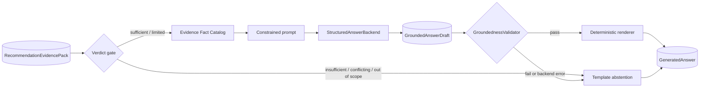

# Grounded answer generation

Phase 10 is an optional projection layer over `RecommendationEvidencePack`. It cannot retrieve
players, change ranking, calculate statistics, or override governance. The default remains the
fully local `TemplateAnswerGenerator`.

## Safety boundary



The model emits typed claims containing only `player_id`, `text`, and `fact_ids`. It never owns
the verdict prefix, Evidence Quality Score, limitations, citations, or fallback behavior.

## Fact allowlist

`build_fact_catalog` creates stable facts directly from returned season profiles and metric
evidence. Player name, team, competition, season, position, minutes, and data quality reference
the typed profile. Raw, normalized, percentile, comparison-group, and sample-size facts retain
the original `PlayerMetricEvidence.source_reference`.

Each claim must satisfy all of these checks:

1. its player is present among returned candidates
2. every Fact ID exists and belongs to that player
3. the player name appears in the claim
4. every numeric literal exists verbatim in a cited fact
5. content words are supported by cited fact labels or values
6. a player receives at most one generated claim

The lexical rule is intentionally conservative. A valid paraphrase can therefore fall back to
the deterministic template. That trade-off keeps unsupported model text out of the API while the
benchmark is still small.

## Answer modes

| `generation_mode` | Meaning |
| --- | --- |
| `template` | deterministic Evidence-Pack projection or mandatory abstention |
| `grounded_model` | structured model draft passed every local validation |
| `safe_fallback` | model failed or its draft was rejected; template text was returned |

`grounding.validation_passed` describes the attempted draft. `grounding.grounding_score` is the
share of draft claims that individually passed; it is not a probability. Fact IDs, violations,
model identifier, and fallback usage remain visible for audit and dashboard display.

## Optional OpenAI adapter

The adapter uses the Responses API's structured parsing support with
`GroundedAnswerDraft` as its Pydantic schema. The default model identifier is configurable and
currently set to `gpt-5.6-terra`; no model is downloaded or API request made in template mode.

```powershell
python -m pip install -e ".[llm]"
$env:OPENAI_API_KEY = "..."
$env:SCOUTRAG_ANSWER_MODE = "openai"
$env:SCOUTRAG_OPENAI_MODEL = "gpt-5.6-terra"
uvicorn scoutrag.main:app --reload
```

See the official [Responses API reference](https://developers.openai.com/api/reference/python/resources/responses/methods/create)
and [Structured Outputs guide](https://developers.openai.com/api/docs/guides/structured-outputs).
The provider adapter is replaceable through `StructuredAnswerBackend`; the fact catalog,
validator, renderer, and benchmark are provider-independent.

## Hallucination benchmark

`evaluation/answer_grounding_cases.json` includes accepted grounded drafts and adversarial drafts
with fabricated values, unauthorized players, invented citations, calculations, and unsupported
tactical interpretation. It also verifies that unsafe governance verdicts never call the model.

```powershell
scoutrag-answer-evaluate
```

The primary failure metric is `false_grounded_rate`: the share of intentionally unsafe drafts
incorrectly accepted as grounded. The committed seed currently records `0.000000`, but ten
rule-authored cases cannot establish production safety or statistical calibration.
