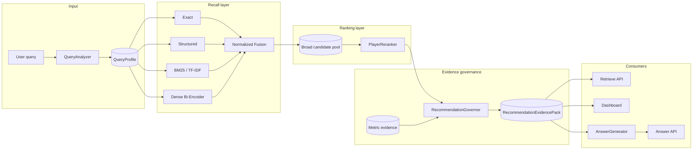
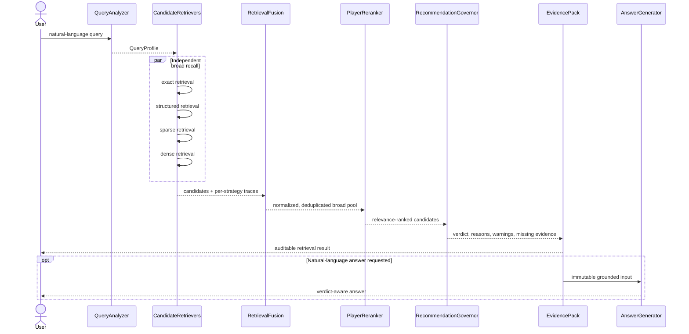
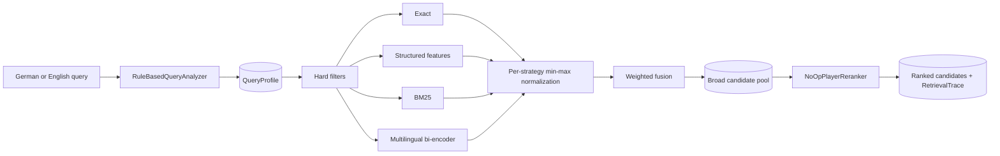
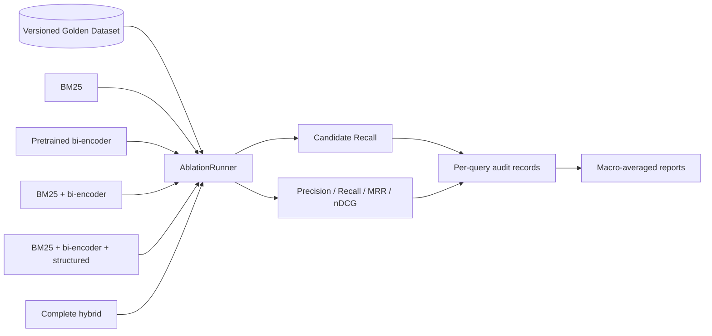
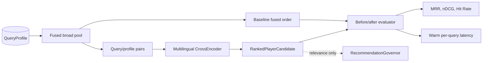
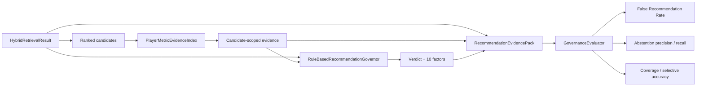

# ScoutRAG architecture

## Design goal

ScoutRAG should retrieve suitable football players while making the limits of its evidence as
visible as its recommendations. The system is decomposed so that improvements to recall cannot
silently change governance, and generation cannot invent new domain facts.

## Component diagram



## Phase 3 data architecture

```mermaid
flowchart TD
    subgraph Source["StatsBomb Open Data"]
        C[competitions.json]
        M[matches/{competition}/{season}.json]
        E[events/{match}.json]
        L[lineups/{match}.json]
    end

    C & M & E & L --> R[StatsBombOpenDataReader]
    R --> N[Event normalization]
    R --> MIN[Lineup interval minute calculation]
    N --> AGG[Season aggregation]
    MIN --> AGG
    AGG --> FE[Per-90 and rate features]
    DEF[Metric definitions] --> FE
    FE --> POS[Position-group percentiles]
    POS --> DQ[Data Quality Score]
    DQ --> PSP[(PlayerSeasonProfile)]
    DQ --> PME[(PlayerMetricEvidence)]
    PSP & PME --> VAL[Cross-record validation]
    VAL --> PAR[Zstd Parquet artifacts]
    VAL --> REP[Validation report]
    PAR & REP --> MAN[SHA-256 manifest]
```

Phase 3 processes one explicit competition-season per pipeline execution. Raw counts remain
available alongside derived features. Per-90 values and pass-completion rates are calculated
deterministically; no model inference or generated statistic is involved.

Competition-season identifiers describe source partitions, not guaranteed full-league coverage.
Validation compares match counts across teams and reports strong imbalances. For the Bundesliga
2023/2024 open-data partition, all 34 Bayer Leverkusen matches are present while opponent coverage
is partial. The implementation is team-neutral, but documentation prefers Bayern Munich examples
where coverage allows it. Bayern has only two observed matches in this partition, so its 21
profiles retain features while percentiles are withheld.

### Feature comparability

Positions are mapped to stable scouting groups: goalkeeper, center back, fullback/wingback,
defensive midfield, central midfield, attacking midfield, winger, and forward. A profile enters a
percentile comparison only when it has at least 450 observed minutes and its primary team's source
coverage is at least 80% of the best-covered team. The group must contain at least three eligible
players. These thresholds are configurable from the command line.

The Data Quality Score is a transparent `0..1` assessment, not a probability:

```text
0.30 × source coverage
+ 0.30 × minutes sufficiency
+ 0.25 × feature coverage
+ 0.15 × comparison-group availability
```

Profile text is a deterministic projection of stored facts and the three highest available
position percentiles. It deliberately avoids unsupported tactical labels.

The primary team for a player is the team with the most observed minutes. If a player changes
teams during the season, `team_names` retains every observed team while the player remains one
season profile. This makes transfer aggregation explicit rather than silently duplicating or
merging identities.

### Persisted artifacts

| File | Contract |
| --- | --- |
| `matches.parquet` | normalized match context and observed duration |
| `events.parquet` | flat event records with stable source references |
| `player_match_minutes.parquet` | lineup-derived minutes and position groups |
| `player_season_profiles.parquet` | raw/normalized features, percentiles, quality, and profile text |
| `player_metric_evidence.parquet` | source-linked raw/normalized values and comparison groups |
| `metric_definitions.json` | names, formulas, required event types, and limitations |
| `validation_report.json` | validity, counts, errors, and limitations |
| `manifest.json` | source metadata and artifact SHA-256 hashes |

## Request sequence



## Phase 4 retrieval architecture

The rule-based analyzer creates a `QueryProfile` before any search starts. Exact, structured,
BM25, and dense retrievers run independently against the same hard filters. Each returns a raw
strategy score and source trace. `WeightedRetrievalFusion` normalizes each score distribution
separately before applying configurable weights.



The dense profile index is season-safe: its keys contain player ID, competition, and season. It
also stores the exact embedding model identifier and is rejected when profiles or model differ.
Index construction latency is outside request tracing when the pipeline is kept alive; a cold CLI
start necessarily includes lazy model loading in the first dense stage.

## Phase 5 evaluation architecture

Evaluation consumes the same public retrieval pipeline used by the CLI. It does not introduce a
second ranking implementation. `HybridRetrievalResult` exposes both the broad fused pool and the
final ranked candidates so candidate recall and ranking quality cannot be conflated.



Golden judgments use a graded `1..3` relevance scale. Candidate Recall is calculated over the
broad pool before `PlayerReranker`; Precision@K, Recall@K, MRR, and nDCG@K use the final ranking.
Reports retain returned player IDs per query, making metric changes debuggable instead of only
publishing one aggregate score.

## Phase 6 reranking architecture

The cross-encoder is an adapter behind the existing `PlayerReranker` port. A small
`PairScoringModel` boundary keeps Sentence Transformers replaceable and allows deterministic CI
tests without downloading a model.



The evaluator retrieves each query once, so baseline and cross-encoder receive identical
candidates. The Torch and ONNX backends implement the same scoring boundary. An explicit ONNX
filename avoids ambiguous artifact selection when a model repository publishes optimized and
quantized variants alongside FP32.

The pretrained MS MARCO cross-encoder currently remains opt-in because it reduced the small
football Golden Dataset's ranking quality. This activation policy is separate from the component
being technically available and tested.

## Phase 7 governance architecture

`GovernedRetrievalPipeline` wraps the public retrieval result without changing candidate recall or
ranking. It selects typed evidence for returned candidate IDs, invokes
`RuleBasedRecommendationGovernor`, and assembles runtime data and all decisions into one
`RecommendationEvidencePack`.



Verdict rules use safety precedence: out-of-scope and empty results short-circuit; conflicts are
reported before score thresholds; missing requested metrics or comparison groups force
insufficient evidence. A result can be sufficient only after every blocking rule passes.

The ten factor values stay separate from dense, fused, and reranker scores. Exact identity lookup
and statistical player discovery use different factor weights because their evidence obligations
differ. Full rules and thresholds are documented in `docs/governance.md`.

## Component ports

The `PipelineComponents` dependency graph exposes six independent roles:

1. `QueryAnalyzer` creates a deterministic `QueryProfile`.
2. One or more `PlayerRetriever` instances perform broad recall.
3. `RetrievalFusion` normalizes and combines strategy-specific results.
4. `PlayerReranker` produces the relevance order.
5. `RecommendationGovernor` assesses evidence sufficiency.
6. `AnswerGenerator`, when configured, renders only the completed evidence pack.

`CandidateRetriever` is a semantic alias of `PlayerRetriever` in the recall stage. Exact,
structured, sparse, and dense adapters implement the same port without changing domain or API
contracts.

## Invariants

### Season integrity

A `PlayerSeasonProfile` represents one player, one competition, and one season. Cross-season
aggregation must be explicit in a future service and must never mutate or silently merge the
source profiles. Same-season transfers remain one profile with an explicit ordered `team_names`
history and a minutes-based primary `team_name`.

### Provenance

Every `PlayerMetricEvidence` carries a `season_id`, comparison group, and `source_reference`.
Evidence-pack validation rejects evidence grouped under a player that is not among the returned
candidates.

### Score semantics

| Value | Meaning | Must not be called |
| --- | --- | --- |
| dense/sparse/structured/exact score | strategy-specific retrieval signal | recommendation confidence |
| fused score | normalized recall-stage combination | evidence quality |
| reranker score | pairwise query/profile relevance | calibrated probability |
| evidence quality score | rule-based sufficiency summary | probability of correctness |

### Governed generation

The future `AnswerGenerator` receives only a `RecommendationEvidencePack`. Expected behavior:

- `SUFFICIENT`: a complete evidence-backed recommendation is allowed.
- `LIMITED`: results are allowed, with prominent limitations.
- `INSUFFICIENT`: abstain from a confident recommendation and explain missing evidence.
- `CONFLICTING`: surface the conflicting signals.
- `OUT_OF_SCOPE`: explain supported ScoutRAG capabilities.

Generation cannot calculate new statistics, add candidates, fill missing values, invent seasons,
or create unsupported tactical claims.

## Deployment boundary through Phase 7

Only `GET /health` is exposed. Retrieval endpoints are intentionally deferred until their
underlying pipeline stages exist:

| Future endpoint | Contract |
| --- | --- |
| `POST /api/v1/retrieve` | returns `RecommendationEvidencePack` |
| `POST /api/v1/answer` | renders a supplied or newly produced evidence pack |
| `POST /api/v1/search` | compact facade over the same retrieval pipeline |

This prevents an HTTP facade from becoming a hidden monolithic implementation.
