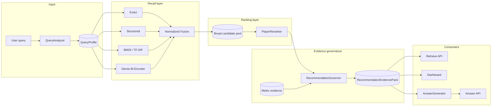
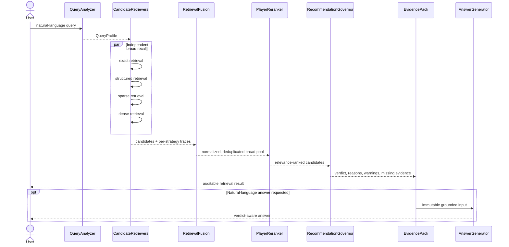

# ScoutRAG architecture

## Design goal

ScoutRAG should retrieve suitable football players while making the limits of its evidence as
visible as its recommendations. The system is decomposed so that improvements to recall cannot
silently change governance, and generation cannot invent new domain facts.

## Component diagram



## Phase 2 data architecture

```mermaid
flowchart TD
    subgraph Source["StatsBomb Open Data"]
        C[competitions.json]
        M[matches/{competition}/{season}.json]
        E[events/{match}.json]
        L[lineups/{match}.json]
    end

    C & M & E & L --> R[StatsBombOpenDataReader]
    R --> N[Event normalization]
    R --> MIN[Lineup interval minute calculation]
    N --> AGG[Season aggregation]
    MIN --> AGG
    AGG --> PSP[(PlayerSeasonProfile)]
    AGG --> PME[(PlayerMetricEvidence)]
    PSP & PME --> VAL[Cross-record validation]
    VAL --> PAR[Zstd Parquet artifacts]
    VAL --> REP[Validation report]
    PAR & REP --> MAN[SHA-256 manifest]
```

Phase 2 processes one explicit competition-season per pipeline execution. Raw counts are
deliberately not converted to per-90 values or percentiles yet; those transformations belong to
Phase 3 and remain independently testable.

Competition-season identifiers describe source partitions, not guaranteed full-league coverage.
Validation compares match counts across teams and reports strong imbalances. For the Bundesliga
2023/2024 open-data partition, all 34 Bayer Leverkusen matches are present while opponent coverage
is partial. Retrieval governance must not interpret those profiles as equally complete.

The primary team for a player is the team with the most observed minutes. If a player changes
teams during the season, `team_names` retains every observed team while the player remains one
season profile. This makes transfer aggregation explicit rather than silently duplicating or
merging identities.

### Persisted artifacts

| File | Contract |
| --- | --- |
| `matches.parquet` | normalized match context and observed duration |
| `events.parquet` | flat event records with stable source references |
| `player_match_minutes.parquet` | lineup-derived minutes and position groups |
| `player_season_profiles.parquet` | raw season profiles; dynamic maps stored as deterministic JSON |
| `player_metric_evidence.parquet` | source-linked raw values and comparison groups |
| `validation_report.json` | validity, counts, errors, and limitations |
| `manifest.json` | source metadata and artifact SHA-256 hashes |

## Request sequence



## Phase 1 ports

The `PipelineComponents` dependency graph exposes six independent roles:

1. `QueryAnalyzer` creates a deterministic `QueryProfile`.
2. One or more `PlayerRetriever` instances perform broad recall.
3. `RetrievalFusion` normalizes and combines strategy-specific results.
4. `PlayerReranker` produces the relevance order.
5. `RecommendationGovernor` assesses evidence sufficiency.
6. `AnswerGenerator`, when configured, renders only the completed evidence pack.

`CandidateRetriever` is a semantic alias of `PlayerRetriever` in the recall stage. A later
composition root can inject exact, structured, sparse, and dense adapters without changing domain
or API contracts.

## Invariants

### Season integrity

A `PlayerSeasonProfile` represents one player, one competition, and one season. Cross-season
aggregation must be explicit in a future service and must never mutate or silently merge the
source profiles. Same-season transfers remain one profile with an explicit ordered `team_names`
history and a minutes-based primary `team_name`.

### Provenance

Every `PlayerMetricEvidence` carries a `season_id`, comparison group, and `source_reference`.
Evidence-pack validation rejects evidence grouped under a player that is not among the returned
candidates.

### Score semantics

| Value | Meaning | Must not be called |
| --- | --- | --- |
| dense/sparse/structured/exact score | strategy-specific retrieval signal | recommendation confidence |
| fused score | normalized recall-stage combination | evidence quality |
| reranker score | pairwise query/profile relevance | calibrated probability |
| evidence quality score | rule-based sufficiency summary | probability of correctness |

### Governed generation

The future `AnswerGenerator` receives only a `RecommendationEvidencePack`. Expected behavior:

- `SUFFICIENT`: a complete evidence-backed recommendation is allowed.
- `LIMITED`: results are allowed, with prominent limitations.
- `INSUFFICIENT`: abstain from a confident recommendation and explain missing evidence.
- `CONFLICTING`: surface the conflicting signals.
- `OUT_OF_SCOPE`: explain supported ScoutRAG capabilities.

Generation cannot calculate new statistics, add candidates, fill missing values, invent seasons,
or create unsupported tactical claims.

## Deployment boundary in Phase 1

Only `GET /health` is exposed. Retrieval endpoints are intentionally deferred until their
underlying pipeline stages exist:

| Future endpoint | Contract |
| --- | --- |
| `POST /api/v1/retrieve` | returns `RecommendationEvidencePack` |
| `POST /api/v1/answer` | renders a supplied or newly produced evidence pack |
| `POST /api/v1/search` | compact facade over the same retrieval pipeline |

This prevents an HTTP facade from becoming a hidden monolithic implementation.
