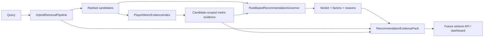

# Phase 7 evidence governance

ScoutRAG governance decides whether retrieved player evidence can support the requested action. It
does not retrieve candidates, change ranking, or generate prose.

## Verdict precedence

Rules are evaluated in safety order:

1. `OUT_OF_SCOPE` for unsupported prediction or non-scouting requests
2. `INSUFFICIENT` when no player satisfies hard filters
3. `CONFLICTING` for incompatible seasons, duplicate player seasons, or materially different
   values for one player-season metric
4. `INSUFFICIENT` when requested metrics, comparison groups, or enough candidates are absent
5. `LIMITED` when a result is possible but material factor warnings remain
6. `SUFFICIENT` only when no blocking or limiting rule applies and the configured score threshold
   is met

`LIMITED` permits a result with visible warnings. `INSUFFICIENT`, `CONFLICTING`, and
`OUT_OF_SCOPE` are abstention verdicts for a confident recommendation.

## Evidence factors

Each factor is independently inspectable on a `0..1` scale:

| Factor | Evidence used |
| --- | --- |
| Data coverage | source coverage stored on the season profile |
| Played minutes | observed minutes relative to the configured full sample |
| Feature availability | number of typed structured features |
| Requested trait coverage | requested metrics present for returned candidates |
| Retrieval agreement | independent strategies that found each candidate |
| Ranking separation | normalized gap between the leading candidates |
| Comparison group | requested evidence with a valid position percentile |
| Season consistency | one compatible competition-season context |
| Missing-value completeness | raw, normalized, and percentile field availability |
| Hard-filter fulfillment | position, team, competition, season, and minute constraints |

Intent changes the weights. Exact identity lookup emphasizes hard-filter fulfillment and season
integrity; player discovery emphasizes requested metrics and comparison groups. Thresholds live in
`GovernanceThresholds` and can be changed without modifying retrieval scores.

The combined `evidence_quality_score` is an uncalibrated rule summary. It must never be presented
as a probability that the recommendation is correct.

## Evidence Pack flow



The evidence index only returns records for ranked candidate IDs. Pack validation rejects evidence
for an unreturned player.

## Safety evaluation

The committed `evaluation/governance_cases.json` covers:

- requested metric unavailable
- partial Bayern profile and limited minutes
- hard filters returning no player
- unknown competition
- unsupported prediction
- conflicting season filters
- sufficient source-covered trait ranking

Run it with the complete hybrid:

```powershell
scoutrag-govern-evaluate --local-files-only
```

Or use the deterministic model-free recall baseline:

```powershell
scoutrag-govern-evaluate --disable-dense
```

The primary metric is False Recommendation Rate: the share of cases that require abstention but
incorrectly receive `SUFFICIENT`. The seed result is `0.0`; this is a regression check, not a
production safety claim.
